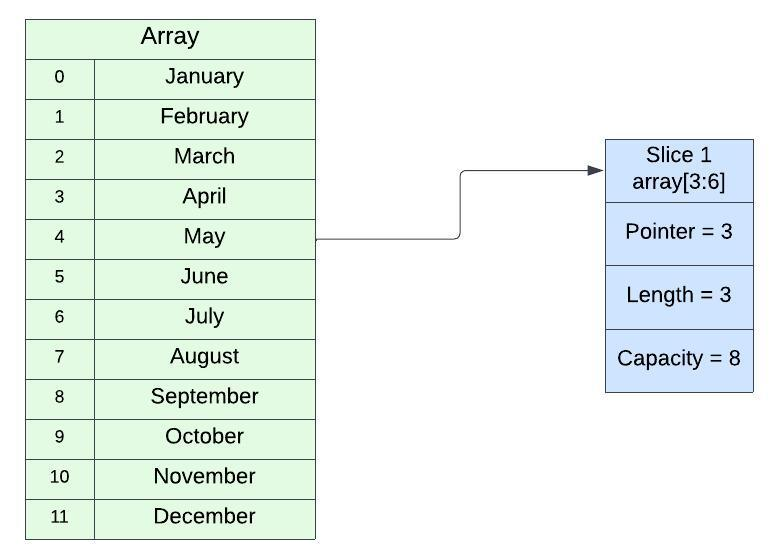

# Slice
- Potongan dari array
- Ukurannya bisa berubah
- dapat mengakses sebagian atau seluruh data di array
- Jika kita mengubah data pada array maka data pada slice akan ikut berubah
	>iniSlice := []int{1, 2, 3, 4, 5}
    
	>iniArray := [...]int{1, 2, 3, 4, 5}
  
### Detail Tipe Data Slice
- Memiliki 3 data
  - *Pointer* --> Penunjuk data pertama di array pada slice
  - *Length* --> Panjang dari slice
  - *Capacity* --> Kapasitas dari slice, dimana *length* tidak boleh lebih dari *capacity* 

| Syntax            | Keterangan |
| -----------       | ----------- |
|array[low:high]    |Membuat slice dari array dimulai dindex low sampai index sebelum high|
|array[low:]        |Membuat slice dari array dimulai index low sampai index akhir di array|
|array[:high]      |Membuat slice dari array dimulai index 0 sampai index sebelum high|
|array[:]           |Membuat slice dari array dimulai index 0 sampai index akhir di array |

---

# Variadic Function
- Parameter berada di posisi akhir, memiliki kemampuan dijadikan sebuah varargs
- Varargs artinya data bisa menerima lebih dari satu input, atau dianggap semacam array, contohnya
  - > (number ...int)
  - > sumAll(slice...)
- Perbedaan parameter biasa dengan tipe data Array
  - Jika parameter Array, kita wajib membuat array terlebih dahulu, sebelum mengirimkan ke function
  - jika parameter menggunakan varargs, kita bisa langsung mengirim datanya, jika lebih dari satu, cukup gunakan tanda koma
  ---
# Closures
  - Closure adalah kemampuan sebuah function berinteraksi dengan data-data di sekitranya dalam scope yang sama
  - Pastikan buat variabel baru untuk cek apakah nama variabel tersebut sudah digunakan di atas 
---
# Defer Function
- Berfungsi untuk menjalankan suatu function meskipun function sebelumnya terjadi error 
---
# Panic Function
- Fungsi yang digunakan untuk menghentikan program
- dipanggil ketika terjadi error pada saat program kita berjalan
- Ketika dipanggil program akan terhenti, namun defer function akan tetap dieksekusi
# Recover Function
- Fungsi yang digunakan untuk menagkap data panic
- Dengan recover proses panic akan terhenti, sehingga program akan tetap berjalan
- Fungsi Recover yang benar ditambahkan pada defer function
# Struct
- disimpan dalam field
- sederhananya struct adalah kumpulan dari field
- Struct biasanya representasi data dalam program aplikasi yang kita buat
- Kita bisa membuat data/object dari struct yang kita buat 
  - > var eko customer

## Struct Method
- bisa digunakan sebagai parameter untuk function
- Jika ingin menambahkan method ke dalam structs, struct akan terlihat seakan akan memiliki sebuah function
- method adalah function
---
# Interface
- Interface adalah tipe data Abstract, dia tidak memiliki implementasi langsung
- Sebuah interface berisikan definisi-definisi method
- Biasanya Interface digunakan sebagia kontrak
- Setiap tipe data yang sesuai dengan kontrak interface, secara otomatis dianggap sebagai interface tersebut
- Sehingga kita tidak perllu mengimplementasikan interface secara manual
## Interface kosong
- Semua tipe data bisa digunakan atau diterima
- Interface kosong adalah interface yang tidak memiliki deklarasi method satupun, hal ini membuat secara otomatis semua tipe data akan menjadi implementasinya
- Go-Lang bukan bahasa pemrograman yang berorientasi objek
- Biasanya dalam pemrograman beriorientasi objek, ada satu data parent di puncak yang bisa dianggap sebagai semua implementasi data yang ada di bahasa pemrograman tersebut
- Contoh di java ada java.lang.Object
- Untuk itu golang menggunakan interface kosong
---
# Type Assertions
- Kemampuan merubah tipe data menjadai tipe data yang diinginkan
- sering digunakan ketika kita bertemu dengan data interface kosong
---
# Pointerdi 
- Kemampuan membuat reference ke lokasi data di memory yang sama, tanpa menduplikasi data yang sudah ada, dengan ini kita bisa membuat pass by reference
---
# GOPATH
- GOPATH adalah environment variable yang berisikan lokasi tempat kita menyimpan project dan library Go-Lang
- Wajib ketika mulai membuat aplikasi lebih dari satu file atau menggunakan library dari luar